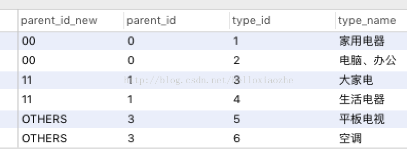
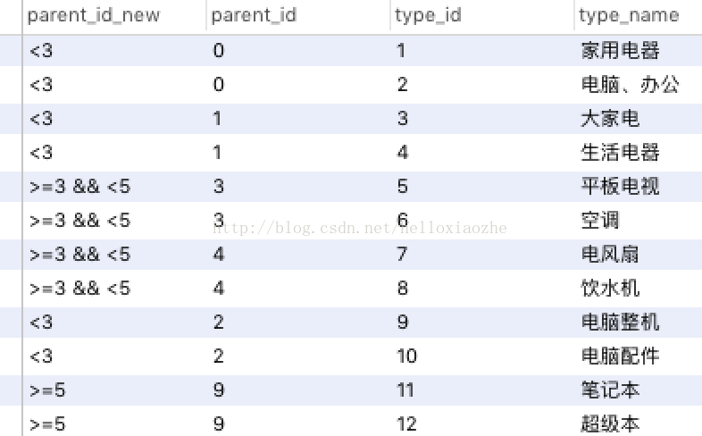

# CASE WHEN 语句
用于计算条件列表并返回多个可能结果表达式之一  
两种格式：简单CASE函数、CASE搜索函数  
   
### 简单CASE函数
   1. 表达式  
   ```
   CASE input_expression
   WHEN when_experssion THEN
           result_expression [...n][
   ELSE
           else_result_expression
   END
   ```
   2. 理解  
   首先计算`input_expression`，然后按指定顺序对每个`WHEN`子句的`input_expression = when_expression`进行计算，返回第一个取值为`TRUE`的`input_expression = when_expression`的 `result_expression`。如果没有取值为TRUE的`input_expression = when_expression`，则返回`ELSE`子句的`else_result_expression`；若没有指定`ELSE`子句，则返回`NULL`值

### CASE搜索函数
   
   1. 表达式  
   ```
   CASE
   WHEN boolean_experssion THEN
      result_expression [...n][
   ELSE
      else_result_expression
   END
   ```
   2. 理解  
   按指定顺序对每个`WHEN`子句的`boolean_expression`求值，返回第一个为`TRUE`的 `boolean_expression`的`result_expression`。如果没有取值为`TRUE`的`boolean_expression`，则返回`ELSE`子句的`else_result_expression`；若没有指定`ELSE`子句，则返回`NULL`值

### 例子
   
   1. 使用带有简单CASE函数的SELECT语句  
   注：在select语句中，简单CASE函数仅检查是否相等，而不进行其他比较  
   ```
   SELECT
      CASE parent_id
      WHEN 0 THEN
         '00'
      WHEN 1 THEN
         '11'
      ELSE
         'OTHERS'
      END AS parent_id_new,
         parent_id,
         type_id,
         type_name
      FROM
         tdb_goods_types
   ```  
   
   
   2. 使用带有简单CASE 函数和 CASE 搜索函数的 SELECT 语句  
   注：在SELECT语句中，CASE搜索函数允许根据比较值在结果集内对值进行替换 
   ```
   SELECT
      CASE
      WHEN parent_id < 3 THEN
         '< 3'
      WHEN parent_id >= 3
        AND  parent_id < 5 THEN
         '>= 3 && < 5'
      ELSE
         '>= 5'
      END AS parent_id_new,
         parent_id,
         type_id,
         type_name
      FROM
         tdb_goods_types
   ```  
   


